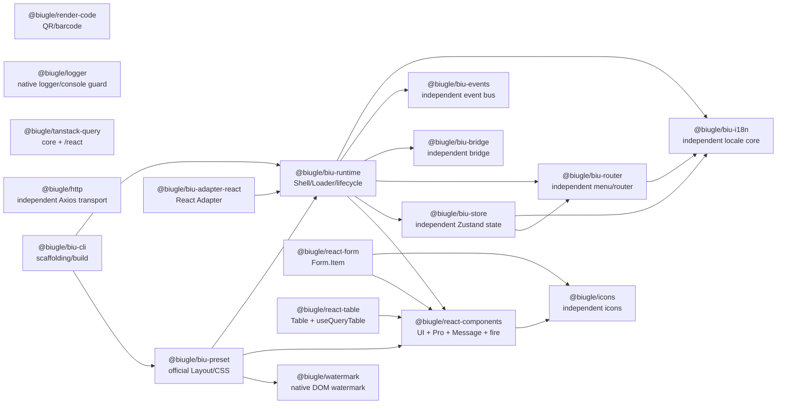

# Public Package Boundaries and Dependency Graph

Public packages are split into independently reusable contracts and foundation orchestration. Independent packages do not depend on Runtime, Preset, Router or Store; foundation packages compose them into Portal and APP delivery modes.

## Independent packages

- `@biugle/react-components` uses the root for Pro presets and `/ui` for composable UI structures. Its Chinese and English defaults live in local JSON resources; `ComponentsProvider` and per-component `localeText` overrides are supported.
- `@biugle/render-code` depends only on `qrcode` and `jsbarcode`. It provides native QR, barcode, export and browser-download helpers without React, Vue, Runtime or Preset.
- `@biugle/watermark` is a native DOM/SVG watermark package with multi-line text, styling, update and destroy support. Preset consumes it instead of maintaining a second watermark behavior, and business apps can use it independently.
- `@biugle/logger` is a native JS package for colored multi-argument logs, console guard, best-effort DevTools detection, cancellable debugger modes and throttled Watermark refresh callbacks. It is React-free and Watermark-free, so any front-end framework can use it independently.
- `@biugle/react-form` owns only `react-hook-form` state, validation and `Form.Item` render props; it composes `@biugle/react-components` and `@biugle/icons` for consistent controls and help icons. Its default error-summary title comes from local Chinese/English JSON and can be overridden on `Form` or `FormErrorSummary`.
- `@biugle/react-table` owns table structure, interactions and `useQueryTable`, not a request client; it composes `@biugle/react-components` for filter, action and status controls and uses Query core types for request adapters. It depends on TanStack Table/Virtual and React. Local `dataSource` supports filtering, stable sorting and page slicing; when the server total is larger than the local page, server pagination is preserved. Empty, loading, pagination and accessibility labels come from local JSON and can be overridden on `Table` or `TablePagination`.
- `@biugle/tanstack-query` is one independent Query package: the root (also available as `/core`) depends only on `@tanstack/query-core`; the `/react` subpath provides the Provider and React hooks and keeps React Query as an optional peer dependency. There is no second React Query package, and HTTP remains React-free.
- `@biugle/http` owns the migrated Axios transport, cancellation, retry, upload and lifecycle hooks; it does not depend on Runtime, UI, authentication or Mock data.
- `@biugle/biu-i18n`, `@biugle/biu-events`, `@biugle/biu-bridge`, `@biugle/biu-router` and `@biugle/biu-store` can be used without a React Shell. They own locale, events, cross-window protocol, menu navigation and persisted state respectively.

Preset, Runtime, Adapter and CLI are orchestration packages. Demo applications use public entries and do not duplicate Tooltip, Ellipsis, Dialog, Drawer, Message, Form, Table or Watermark implementations. Chart, RichText, Editor and Preview Server are outside the base packages.
