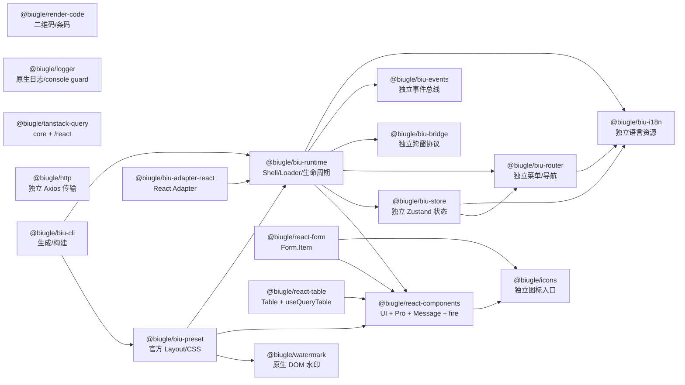

# 公共包边界与依赖关系

仓库中的公共包按“可独立复用”和“基座编排”分开。独立包不依赖 Runtime、Preset、Router 或 Store；基座包负责把这些能力组合成 Portal/APP 运行形态。

## 独立包说明

- `@biugle/react-components` 的根入口是 Pro 预设，`@biugle/react-components/ui` 是 UI 结构入口。组件包只依赖图标、React 和自身的视觉运行时；默认文案由 `src/locale/zh-CN.json` 与 `src/locale/en-US.json` 管理，`ComponentsProvider` 或组件 `localeText` 可以覆写。
- `@biugle/render-code` 只依赖 `qrcode` 与 `jsbarcode`，提供原生 QRCode、Barcode、导出和浏览器下载方法，不绑定 React、Vue、Runtime 或 Preset。
- `@biugle/watermark` 是原生 DOM/SVG 水印包，支持多行文案、样式、更新和销毁；Preset 只消费它，不复制另一套水印行为，业务也可以独立使用。
- `@biugle/logger` 是原生 JS 日志、console guard 和最佳努力 DevTools 检测包，支持彩色多参数日志、console 恢复、可取消 debugger 以及节流的 Watermark 刷新回调；它不依赖 React 或 Watermark，可独立用于任意前端框架。
- `@biugle/react-form` 只负责 `react-hook-form` 状态、校验和 `Form.Item` render props，不拥有接口请求；使用 `@biugle/react-components` 和 `@biugle/icons` 组合统一控件/提示图标。默认错误汇总标题来自本包的中英文 JSON，可通过 `Form locale/localeText` 或 `FormErrorSummary` 参数覆盖。
- `@biugle/react-table` 只负责表格结构、交互和 `useQueryTable`，不拥有请求客户端；使用 `@biugle/react-components` 组合筛选、操作和状态控件，使用 Query core 类型定义请求适配。它依赖 TanStack Table/Virtual 和 React；本地 `dataSource` 支持筛选、稳定排序和分页裁切，服务端总数大于本地数据量时保留服务端分页；默认空态、加载态、分页和无障碍文案来自本包 JSON，可通过 `Table locale/localeText` 或 `TablePagination` 参数覆盖。
- `@biugle/tanstack-query` 是一个独立的单包 Query 标准层：root（也可从 `/core` 使用）只依赖 `@tanstack/query-core`，`/react` 子路径才提供 Provider 和 React hooks，并将 React Query 保持为可选 peer dependency；不新增第二个 React Query 包，也不让 HTTP 依赖 React。
- `@biugle/http` 只负责迁移后的 Axios 传输、取消、重试、上传和生命周期钩子；它不依赖 Runtime、UI、认证或 Mock。
- `@biugle/biu-i18n`、`@biugle/biu-events`、`@biugle/biu-bridge`、`@biugle/biu-router` 和 `@biugle/biu-store` 都可以脱离 React Shell 单独使用。它们分别维护语言、事件、跨窗口协议、菜单导航和状态持久化边界。

Preset、Runtime、Adapter 和 CLI 是基座编排层。Demo 只使用公开入口，不复制 Tooltip、Ellipsis、Dialog、Drawer、Message、Form、Table 或 Watermark 的第二套实现。Chart、RichText、Editor 和 Preview Server 不属于基础包。
